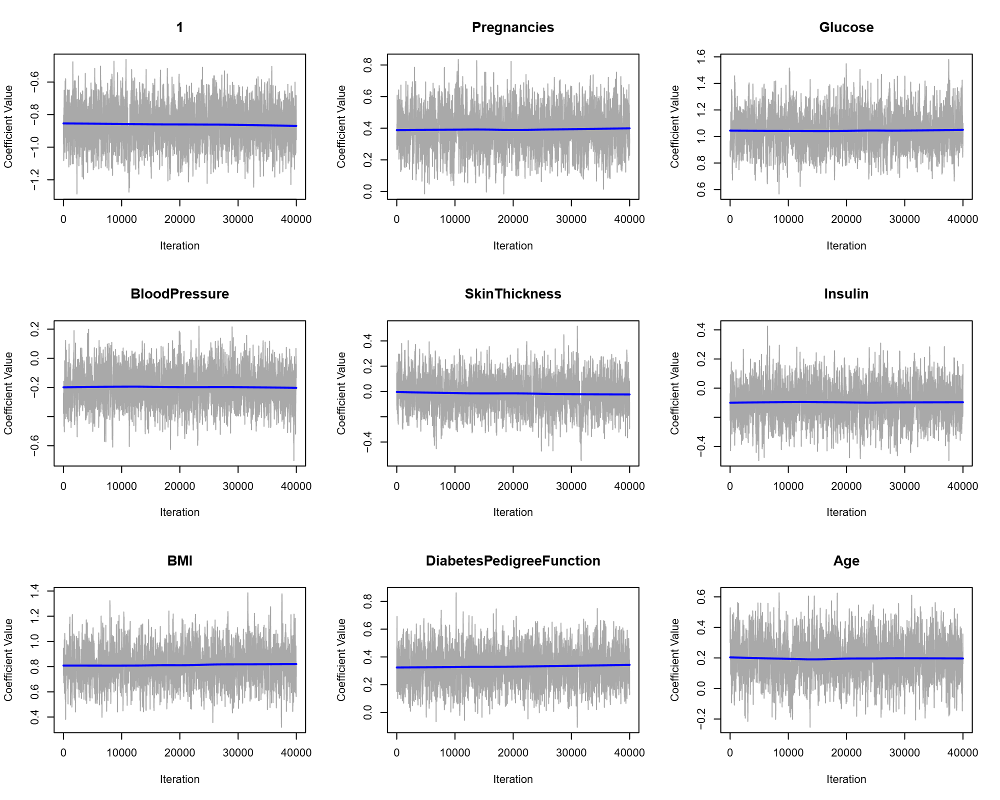
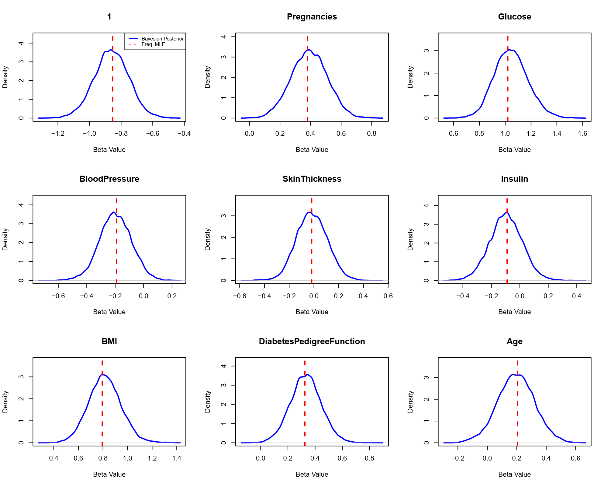

# Bayesian Logistic Regression via Metropolis-Hastings


> **A "from-scratch" implementation of Markov Chain Monte Carlo (MCMC) methods to quantify uncertainty in medical diagnosis.**

## 1. Project Overview
This project implements a **Bayesian Logistic Regression** model to predict the onset of diabetes using the famous **Pima Indians Diabetes Dataset**. 

Unlike standard Frequentist approaches (like `glm` in R) that provide point estimates for risk factors, this project adopts a **Bayesian framework**. We treat regression coefficients as random variables and estimate their full **posterior distributions**. 

**Key Highlights:**
* **No "Black Box" Solvers:** The Metropolis-Hastings MCMC sampler was written entirely from scratch in R.
* **Uncertainty Quantification:** We derive credible intervals for risk factors like Glucose and BMI.
* **Model Comparison:** We validate our Bayesian estimates against standard Maximum Likelihood Estimates (MLE).

---

## 2. Theoretical Background

### The Model
We model the binary outcome $y_i \in \{0,1\}$ (Diabetes vs. Healthy) using the logistic sigmoid function:

$$P(y_i=1 | \mathbf{x}_i, \boldsymbol{\beta}) = \frac{1}{1 + \exp(-\mathbf{x}_i^T \boldsymbol{\beta})}$$

### Bayesian Inference
We aim to sample from the **Posterior Distribution**, which is proportional to the Likelihood times the Prior:

$$p(\boldsymbol{\beta} | \mathbf{y}, \mathbf{X}) \propto L(\boldsymbol{\beta} | \mathbf{X}, \mathbf{y}) \cdot p(\boldsymbol{\beta})$$

* **Likelihood:** Bernoulli product over $N$ observations.
* **Prior:** Weakly informative Gaussian prior $\boldsymbol{\beta} \sim \mathcal{N}(\mathbf{0}, 100\mathbf{I})$, acting as L2 regularization.

Since the marginal likelihood is intractable, we use **Markov Chain Monte Carlo (MCMC)** to approximate the posterior.

---

## 3. Implementation Details

The core algorithm is a **Random Walk Metropolis-Hastings** sampler. 

### The Algorithm (R Code Snippet)
Instead of using packages like `rstan` or `JAGS`, the logic was implemented manually to demonstrate understanding of the underlying theory:

```r
# Core Metropolis-Hastings Loop
run_mh_sampler <- function(N_iter, X, y, prop_cov) {
  # ... initialization ...
  
  for (i in 1:N_iter) {
    # 1. Propose new state (Random Walk)
    beta_prop <- rmvnorm(1, mean = beta_curr, sigma = prop_cov)
    
    # 2. Calculate Metropolis Ratio (Log domain)
    log_alpha <- log_posterior(t(beta_prop), X, y) - log_posterior(beta_curr, X, y)
    
    # 3. Accept or Reject
    if (log(runif(1)) < log_alpha) {
      beta_curr <- beta_prop   # Update state
    }
    samples[i, ] <- beta_curr  # Store sample
  }
  return(samples)
}
```

### Tuning
* **Iterations:** 50,000
* **Burn-in:** 10,000
* **Step Size:** Tuned to $\sigma^2 = 0.003$ to achieve an optimal acceptance rate of ~45%.

---

## 4. Empirical Results

### A. Convergence Diagnostics
The MCMC chain exhibits excellent mixing. The "fuzzy caterpillar" trace plots indicate that the sampler has converged to the stationary distribution.



### B. Bayesian vs. Frequentist Comparison
We compared our posterior means against the standard MLE estimates. The alignment is nearly perfect, validating the correctness of our sampler.



**Statistical Comparison:**

| Parameter | Frequentist Est. | Bayesian Mean | Interpretation |
|-----------|------------------|---------------|----------------|
| Glucose | 1.020 | 1.046 | Strong positive risk factor |
| BMI | 0.794 | 0.815 | Strong positive risk factor |
| SkinThickness | -0.018 | -0.016 | Negligible effect (overlaps 0) |

### C. Predictive Performance
Evaluated on a held-out test set ($N=153$):
* **Accuracy:** 77.78%
* **Sensitivity:** 86.00% (High ability to detect diabetes)
* **Specificity:** 62.26%

---

## 5. Conclusion
This project successfully demonstrated that:
* **Algorithms matter:** A custom-built MCMC sampler can match the accuracy of industrial software.
* **Uncertainty is key:** Variables like SkinThickness had posterior distributions centering on zero, suggesting they are not significant predictors—an insight harder to see with simple point estimates.
* **Clinical Relevance:** Glucose and BMI were identified as the primary drivers of diabetes risk in the Pima population.

